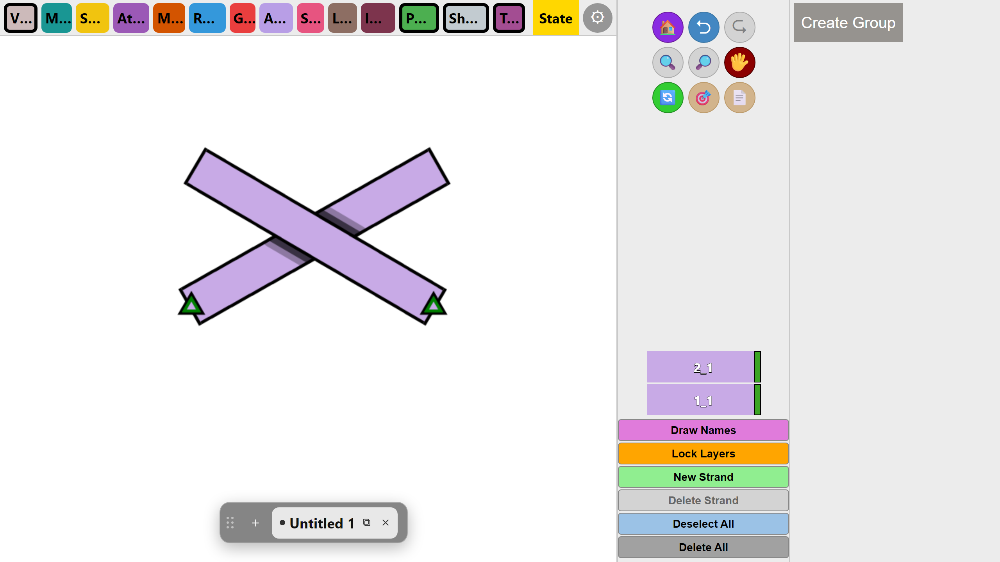

# OpenStrandJS

**A web app for drawing strands, knots, and braids — right in your browser.**

OpenStrandJS is a browser-based reimplementation of [OpenStrand Studio](https://github.com/ysetbon/OpenStrandStudio),
the desktop strand/knot diagramming tool. Nothing to install — open the link and start drawing.

### ▶️ [**Try it live → ysetbon.github.io/OpenStrandJS**](https://ysetbon.github.io/OpenStrandJS/)

[](https://ysetbon.github.io/OpenStrandJS/)

> *Click the image above to open the live editor.*

---

## What you can do

- 🧵 **Draw strands** — click **New Strand**, then drag on the canvas.
- 🔗 **Attach & connect** strands end-to-end to build knots and braids.
- 🎭 **Mask crossings** so strands weave over and under each other.
- 🎚️ **Move, rotate, and adjust** angles and lengths of any strand.
- 🌑 **Shadows** for a sense of depth where strands overlap.
- 🗂️ **Layers panel** — every strand is a layer you can select, recolor, and reorder.
- 👥 **Groups** — move and transform several strands together.
- 💾 **Save / load** your work and **export a PNG** of the result.

## Try it online

No setup required — just open:

**https://ysetbon.github.io/OpenStrandJS/**

Works in any modern browser (Chrome, Edge, Firefox, Safari).

## Run it on your own machine

You only need [Node.js](https://nodejs.org/) (v18+).

```bash
git clone https://github.com/ysetbon/OpenStrandJS.git
cd OpenStrandJS
npm install
npm run dev        # opens http://localhost:5173
```

To build the static site yourself:

```bash
npm run build:editor   # output in dist-editor/
npm run preview        # serve the built site locally
```

## About this project

OpenStrandJS is a faithful, "fidelity-first" port of the original desktop app,
**[OpenStrand Studio](https://github.com/ysetbon/OpenStrandStudio)** (a PyQt5
application). The goal is a web version whose rendering matches the desktop
original closely — pixel-for-pixel where possible — and whose behaviour
(masking, save/load, undo/redo) matches exactly.

It's built with **TypeScript**, **React**, **[Paper.js](http://paperjs.org/)**
(for the path/boolean geometry the masking engine needs), and the HTML5
**Canvas**. See [`UI_PORT_PLAN.md`](UI_PORT_PLAN.md) and the other `*_PLAN.md`
files for the porting notes.

## CI / CD / code review bots

GitHub Actions handle checks and deployment (see [`docs/CI_CD.md`](docs/CI_CD.md)
for the full setup, including the review bots):

- **CI** — every PR and push to `main` runs the TypeScript typecheck, the Vite
  production build, and headless Chromium smoke tests that render real
  fixtures and boot the built editor (`tools/ci_smoke.mjs`). Rendered PNGs are
  attached to each run as an artifact.
- **CD** — merging to `main` automatically builds and publishes the editor to
  GitHub Pages. Manual deploys still work:

  ```bash
  npm run deploy     # builds and publishes to the gh-pages branch
  ```

- **Reviews** — each PR gets an automatic review from
  [CodeRabbit](https://coderabbit.ai) (free for this public repo) and from the
  Claude Code workflow (needs the `ANTHROPIC_API_KEY` repo secret).

The site updates at https://ysetbon.github.io/OpenStrandJS/ within a minute of a merge.

## License

GNU General Public License v3.0 — the same license as
[OpenStrand Studio](https://github.com/ysetbon/OpenStrandStudio).
